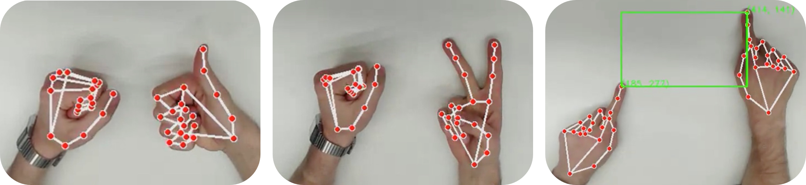
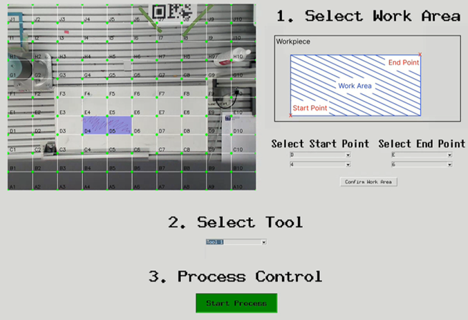

# 330.328 VU 2024W Robot Challenge

## Authors: 

- [Kilian Kliegel](https://github.com/KilianK2)
- [Johannes Kestler](https://github.com/Johanneskestler)

## Description

In this project we aimed to implement flexible workspace specification in a industrial grinding task using a cobot.

The cobot used is the UR3e.

The Code allows for gesture Control for a selection of 3 different tools and precise workspace specification using a 
simple RBG webcam.



Additionally a GUI based workflow has been implemented as a comparison baseline



## Settings

### Operating System

To run this repository we recommend a native Ubuntu 22.04 installation. 

### Dependencies
#### Hardware Requirements
- UR3e Robot
- Robotiq Gripper
- Webcam (for gesture tracking)

#### Software Requirements
- Python 3.8 or higher
- Network connection to the robot (configured IP: 192.168.56.101)

#### Python Packages
```bash
rtde_control>=2.0.0
rtde_receive>=2.0.0
robotiq-gripper-controller>=1.0.0
numpy>=1.21.0
opencv-python>=4.5.0
mediapipe>=0.8.9
```

#### Setup Instructions
1. Install Python requirements using pip:
```bash
pip install -r requirements.txt
```

2. Robot Setup:
- Ensure the robot is connected to the network
- Verify the robot IP address (default: 192.168.56.101)
- Robot should be in remote control mode

3. Gripper Setup:
- Connect the Robotiq gripper to the UR3e
- Ensure the gripper is properly configured in the robot settings

#### Running the Application
There are two ways to control the robot:

1. Gesture Control:
```bash
python gesture_controller.py
```
This starts the gesture recognition interface. Use hand gestures to:
- Select tools with thumb gestures (1-3 fingers)
- Define workspace points with pointing gestures
- Confirm selections with thumbs up

2. GUI Control:
```bash
python terminal_controller.py
```
This starts the graphical user interface where you can:
- Select tools via buttons
- Define workspace points using mouse clicks
- Control the robot through menu options

### Additonal Ressources

To run this code you need to download 'gesture_recognizer.task' from mediapipe and place it into the project folder

## Sources

This project built on top of this repository: https://github.com/robin-gdwl/UR_Facetracking

Furthermore we utilized mediapipe hands: https://ai.google.dev/edge/mediapipe/solutions/vision/gesture_recognizer?hl=de

